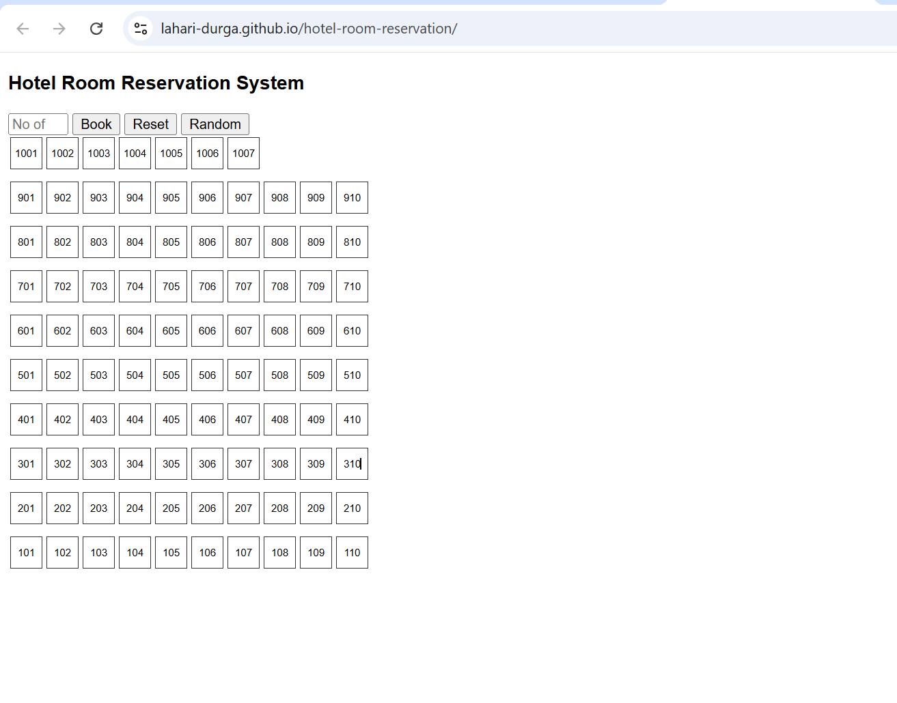
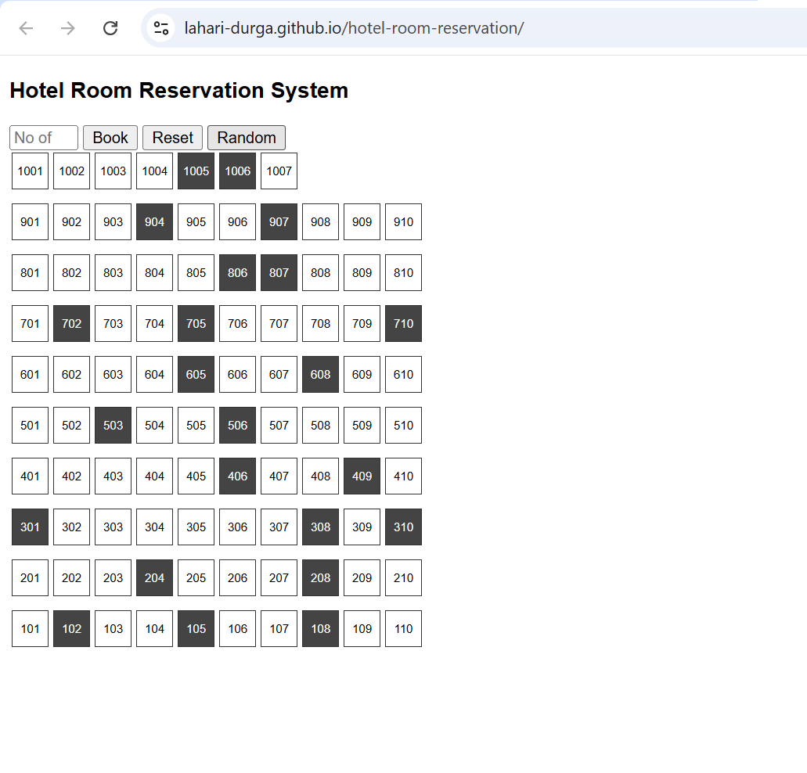

# Hotel Room Reservation System

A lightweight, rule-based hotel room reservation system built as part of an SDE assessment.  
The application allocates rooms by minimizing total travel time while strictly following the given constraints.

---

## 🏨 Problem Summary

The hotel consists of **97 rooms across 10 floors**:

- **Floors 1–9:** 10 rooms per floor (101–110, 201–210, ...)
- **Floor 10:** 7 rooms (1001–1007)
- Rooms are arranged left to right, with the leftmost room closest to the staircase/lift

A guest can book **up to 5 rooms per request**.

---

## ⏱ Travel Time Rules

- **Horizontal travel:** 1 minute per adjacent room on the same floor  
- **Vertical travel:** 2 minutes per floor  
- Total travel time = vertical distance + horizontal distance

---

## 📌 Booking Logic

1. A maximum of **5 rooms** can be booked at a time.
2. Priority is given to booking rooms on the **same floor**.
3. If insufficient rooms are available on one floor:
   - Rooms are selected across floors.
   - Allocation minimizes combined vertical and horizontal travel time.
4. Once booked, rooms are marked unavailable for future bookings.

---

## 🖥 Application Features

- Input to enter number of rooms to book
- **Book Rooms** button
- **Random Occupancy** simulation
- **Reset** button to clear all bookings
- Visual floor-wise room layout showing available and booked rooms

---

## 🛠 Tech Stack

- HTML
- CSS
- JavaScript (Vanilla)

No external libraries or frameworks are used.  
All logic runs on the client side.

---

## 🔗 Live Demo

👉 https://lahari-durga.github.io/hotel-room-reservation/

---

## 📸 Screenshots





---

## 📂 Repository Structure

```
hotel-room-reservation/
│
├── index.html
├── README.md
└── screenshots/
```


## 👤 Author

**Lahari Durga Challapalli**
